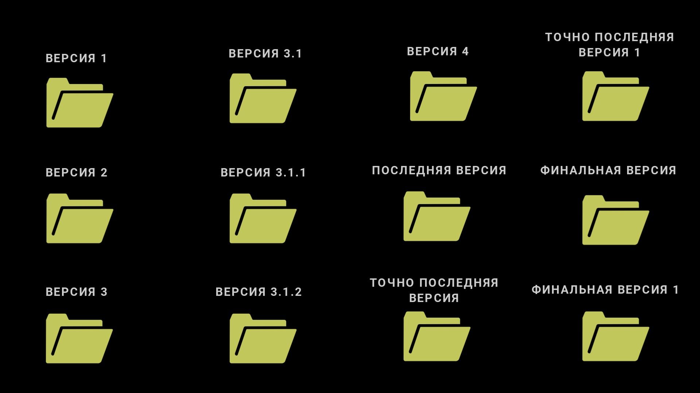

# 🗃️ Git

### Зачем нужен Git?

Разработка любого успешного приложения или игры это динамический процесс. Требования со временем меняются, продукт развивается, разработчики устраняют баги и добавляют новые фичи (с новыми багами, разумеется). Чем больше и сложнее такой продукт, тем больше проблем появляется в процессе разработки. В прошлом разработчики путались в версиях, правках, зонах ответственности, синхронизации актуальной версии и т.д.

<figure><figcaption>
Бесконечность не предел
</figcaption></figure>

Нельзя сказать, что все проблемы такого рода остались в прошлом, но сейчас ситуация с этим обстоит значительно лучше, так как разработчики прошлого хорошо постарались. Им нужно было навести порядок в процессе, придумать какой-нибудь протокол действий. Нет хаоса - нет проблем. Но заставить разработчиков следовать строгому протоколу не просто, так как зачастую это неудобно, да и человеческий фактор будет создавать проблемы. Чтобы люди следовали этим правилам, они должны быть простыми и естественными. Например, люди могли бы делегировать контроль над процессом разработки какой-либо системе, внутри которой правилам стало бы легко следовать.

<figure><figcaption>
Git объединяет различные стадии
</figcaption></figure>

Таким образом человечество пришло к понятию "система контроля версий". Простыми словами, система контроля версий или `VCS` _(от англ. **Version Control System**)_ - это программа, которая мониторит изменения в файлах проекта и записывает историю этих изменений, чтобы разработчики могли управлять различными версиями своего продукта.

Самая популярная система контроля версий это `Git`.&#x20;


`Git` относится к распределенным системам контроля версий _(от англ. **distributed version control**)_, что означает что каждый разработчик локально хранит свою версию проекта, которую он синхронизирует с остальными. Эта концепция имеет ряд преимуществ относительно аналогов.


<figure><figcaption>
Логотип Git
</figcaption></figure>

### Ключевые понятия Git

`Git` отслеживает изменения во всех файлах, которые находятся в указанной директории. Эту директорию (папку) можно воспринимать как проект, в которым мы работаем (это и есть директория с проектом). Однако проект, то есть содержимое этой директории, меняется со временем. Его можно сравнить с отдельной вселенной, которая с течением времени меняется. `Git` хранит не только текущее состояние, но и всю историю, все прошлые состояния проекта, что можно сравнить с таймлайном этой вселенной.

<figure><figcaption>
Таймлайн событий
</figcaption></figure>

Такой таймлайн в терминологии `Git` принято называть **репозиторием**. Любой **репозиторий** воспринимается как отдельный проект, с тем отличием, что в нем записаны все прошлые состояния проекта. А это значит, что мы сможем путешествовать во времени внутри этого проекта.

Возникает логичный вопрос, откуда Git знает, когда сделать очередной "снимок" проекта, то есть сохранить текущее состояние? На самом деле это решение принимают разработчики, поэтому таймлайн любого **репозитория** состоит из конечного числа фиксированных состояний. Такие промежуточные состояния называются **коммитами** _(от англ. **commit**, сокращение от **commitment**)._&#x20;

Слово **commit** нормально не переводится, ближайший по смыслу перевод это "единица внесенного вклада"_._ Это можно сравнить с контрольной точкой в игре: когда что-то важное произошло (или скоро произойдет), мы сохраняемся, чтобы при необходимости в будущем быстро вернуться к этой точке во времени. **Коммиты** работают по той же логике - каждый **коммит** это одна контрольная точка на таймлайне.

<figure><figcaption>
Каждый коммит это новое состояние репозитория
</figcaption></figure>

Если разные разработчики работают над разными независимыми частями проекта, то они смогут закоммитить свою работу без проблем. Но что если их области ответственности пересекаются? В таком случае, им было бы удобно работать в некотором изолированном пространстве и соединить конечный результат своей работы только один раз. Возвращаясь к аналогии, это тоже самое, что создать временную параллельную вселенную для экспериментов, поработать над ней, а потом соединить ее с основным таймлайном. Визуально это бы выглядело как **ветка**, исходящая из основного таймлайна. Поэтому, соответствующий термин в терминологии `Git` называется также - **ветка** _(от англ. **branch**)_.


Основной таймлайн принято считать главной **веткой**, она называется `main` (в переводе "главная" или "основная"). Другим **веткам** мы даем имена при создании.


Когда мы закончили работу в созданной ветке, мы хотим объединить ее с главной. Процесс такого объединения называется **слиянием веток** _(от англ. merge)_, в его результате формируется коммит в родительскую ветку, содержащий изменения из обеих веток.


Иногда при слиянии происходят ситуации, когда две ветки содержат разные версии одного файла и `Git` не может решить, что с ними делать. Такая ситуация называется **конфликтом** _(от англ. **conflict**)_. В этом случае требуется либо вручную решить конфликт, то есть указать (написать) конечную версию файла.


Давайте повторим рассмотренные термины:

<table data-view="cards"><thead><tr><th></th><th></th><th></th></tr></thead><tbody><tr><td><strong>Репозиторий</strong> - проект и таймлайн его развития, состоящий из последовательных <strong>коммитов</strong></td><td></td><td></td></tr><tr><td><strong>Коммит</strong> - контрольная точка на таймлайне, к которой можно вернуться при необходимости</td><td></td><td></td></tr><tr><td><strong>Ветка</strong> - изолированный таймлайн <strong>коммитов</strong>, который можно объединить с родительской <strong>веткой</strong></td><td></td><td></td></tr><tr><td><strong>Слияние веток</strong> - объединение двух <strong>веток</strong> в одну, то есть перенос изменений из дочерней <strong>ветки</strong> в главную</td><td></td><td></td></tr><tr><td><strong>Конфликт</strong> - ситуация, воникающая при слиянии веток, которые содержат разные версии одного файла</td><td></td><td></td></tr></tbody></table>
